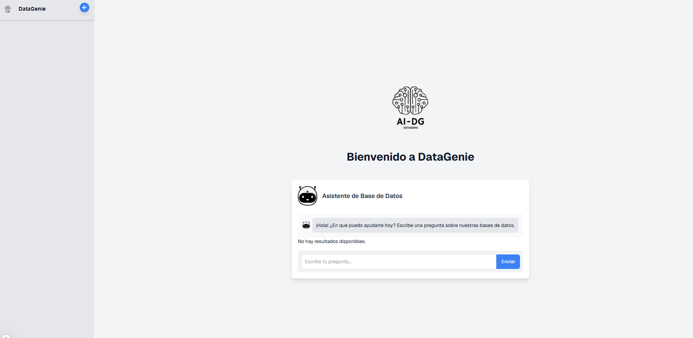

# Chatbot RAG - Asistente de Base de Datos

Este es un proyecto de un chatbot interactivo que permite a los usuarios hacer preguntas sobre bases de datos, recibir respuestas en forma de consultas SQL y ver los resultados en una tabla. Además, el proyecto incluye la capacidad de descargar los resultados en formato Excel.

## Tecnologías

### Backend
- **FastAPI**: El backend está construido utilizando FastAPI, que se encarga de procesar las consultas SQL y devolver los resultados.
- **MySQL o MongoDB**: El backend se conecta a una base de datos MySQL o MongoDB para ejecutar las consultas y devolver los resultados.
- **SQLAlchemy (para MySQL)**: Usado para interactuar con la base de datos MySQL.
- **Pymongo (para MongoDB)**: Usado para interactuar con MongoDB.

### Frontend
- **React (con Next.js)**: El frontend está construido utilizando React y Next.js, que permiten la creación de una interfaz de usuario interactiva para hacer preguntas al chatbot y ver los resultados.
- **Axios**: Utilizado para realizar las solicitudes HTTP al backend.
- **XLSX.js**: Se usa para generar y descargar el archivo Excel con los resultados de la consulta.

## Estructura del Proyecto

El proyecto tiene dos partes principales: el frontend y el backend.

### Backend
El backend es una API construida con FastAPI que se encarga de manejar las solicitudes de consultas SQL y devolver los resultados en formato JSON.

#### Archivos principales del Backend:
- **app/main.py**: El archivo principal que define las rutas de la API.
- **app/db.py**: El archivo que maneja la conexión a la base de datos (MySQL o MongoDB).
- **app/models.py**: Define los modelos de datos para interactuar con la base de datos.

### Frontend
El frontend es una aplicación React que permite a los usuarios interactuar con el chatbot y ver los resultados de las consultas SQL en una tabla. Además, tiene la funcionalidad para descargar los resultados en un archivo Excel.

#### Archivos principales del Frontend:
- **src/app/components/Chatbot.jsx**: El componente principal del chatbot que gestiona la interfaz de usuario y las interacciones con el backend.
- **src/app/styles/global.css**: Los estilos globales para la aplicación.
- **src/app/pages/index.js**: La página principal que muestra el chatbot.


### Ejemplo de funcionamiento


## Instalación

### Backend

1. **Clonar el repositorio**:

   ```bash
   git clone https://github.com/LeoR22/Chatbot_RAG.git
   cd backend
   ```

2. **Instalar dependencias:**:Si estás utilizando un entorno virtual, activa el entorno antes de instalar las dependencias.

   ```bash
   pip install -r requirements.txt
   ```

3. **Configurar las bases de datos:**

- Asegúrate de tener MySQL y MongoDB configurado correctamente.
- En la carpeta Backend/app/infrastructure/db, actualiza las configuraciones de las bases de datos y sus credenciales.


4. **Ejecutar el servidor**: Para ejecutar el servidor de FastAPI, usa el siguiente comando:

   ```bash
   uvicorn app.main:app --reload
   ```

### Frontend

1. **Abrir otro proyecto y cambiar de carpeta**:

   ```bash
   cd frontend
   ```

2. **Instalar dependencias:**:

   ```bash
   npm install
   ```

3. **Configurar la URL del backend:** Crea el archivo .env, configura la URL de tu API backend:

   ```bash
   NEXT_PUBLIC_API_URL=<http://localhost:8000>  
   ```

4. **Ejecutar el servidor**: Para ejecutar el frontend en modo de desarrollo:

   ```bash
   npm run dev
   ```
Esto iniciará la aplicación en <http://localhost:3000>.


### USO

- **Interactuar con el Chatbot:**

   - Escribe preguntas relacionadas con la base de datos.
   - El chatbot generará una consulta SQL y devolverá los resultados en una tabla.

- **Descargar los resultados:**
   - Si hay resultados disponibles, puedes hacer clic en el botón "Descargar Excel" para obtener un archivo Excel con los resultados de la consulta.
- **Visualizar la tabla de resultados:**
   - Los resultados de la consulta se mostrarán en una tabla interactiva debajo de la conversación.


### Instrucciones de uso

1. Clonar el repositorio y seguir los pasos para instalar tanto el frontend como el backend.
2. Configurar las credenciales de la base de datos en el backend.
3. Ejecutar ambos servidores y acceder a la aplicación.

## Contribuciones

**Si deseas contribuir a este proyecto, sigue estos pasos:**

1. Haz un fork del repositorio.
2. Crea una nueva rama (`git checkout -b feature-nueva-funcionalidad`).
3. Realiza tus cambios y haz commit (`git commit -m 'Agrega nueva funcionalidad'`).
4. Sube los cambios a la rama (`git push origin feature-nueva-funcionalidad`).
5. Abre un Pull Request.

## Licencia

Este proyecto está licenciado bajo la Licencia MIT. Consulta el archivo LICENSE para más detalles.

## Contacto

Leandro Rivera: <leo.232rivera@gmail.com>

### ¡Feliz Codificación! 🚀

Si encuentras útil este proyecto, ¡dale una ⭐ en GitHub! 😊
